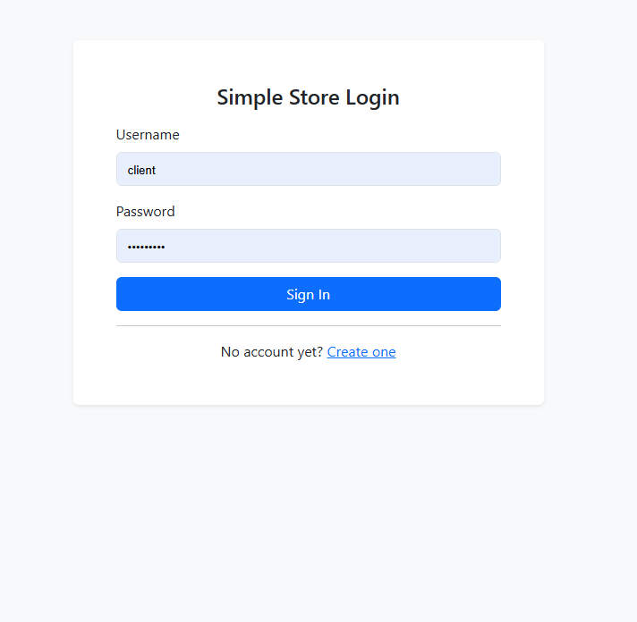
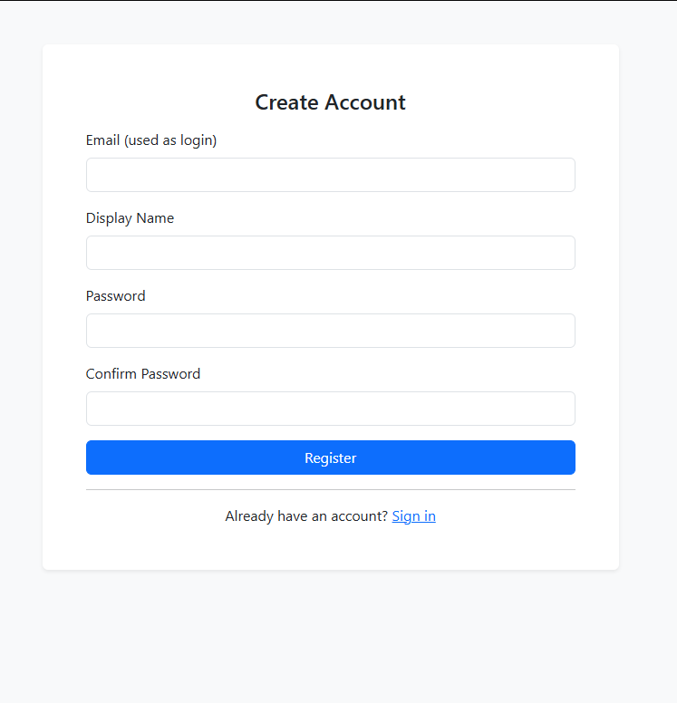
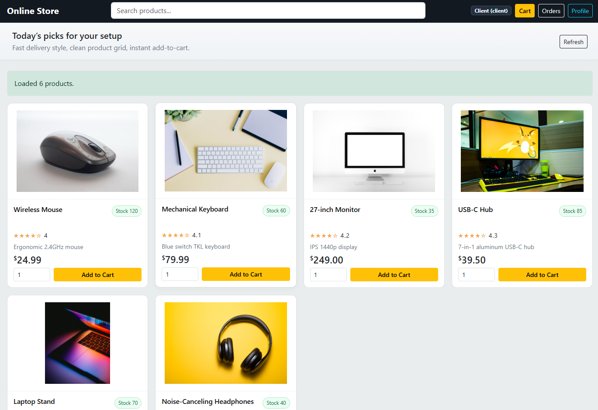
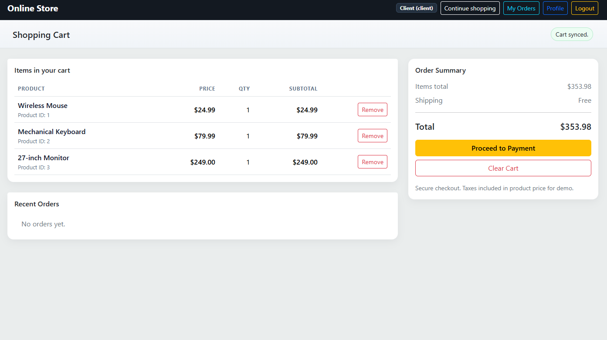
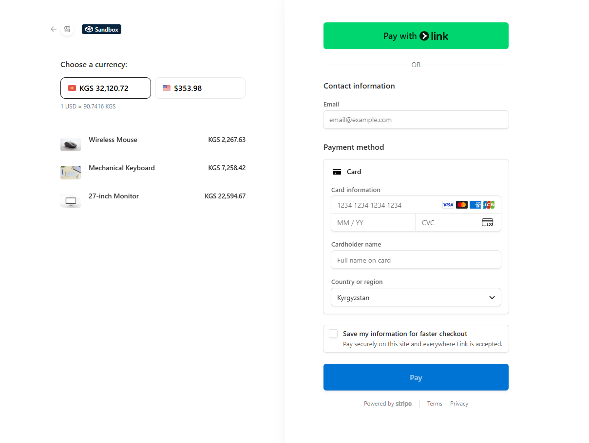
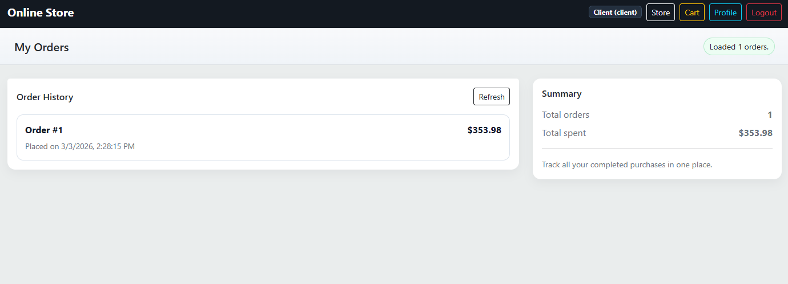
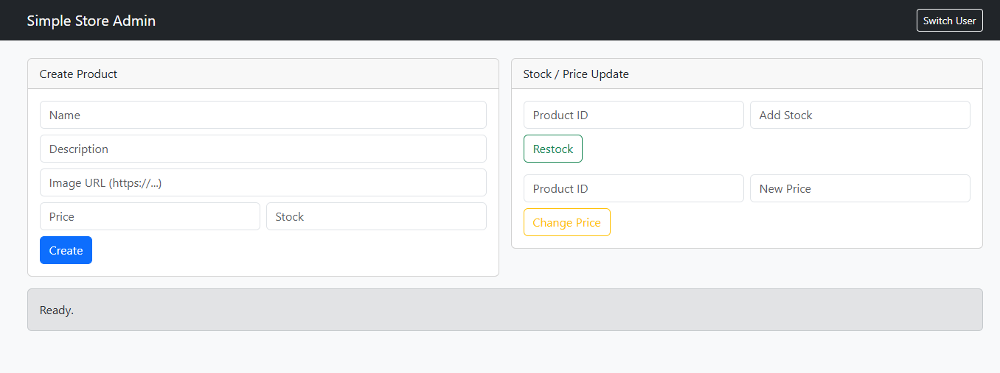

# Spring Boot Online Store

Built a small online store with login, roles, cart, orders, profile, admin page, and embedded card payment.

Used this project to practice DDD-style structure and real checkout flow (not just CRUD).

## Includes

- `ADMIN` / `CLIENT` roles
- Registration + custom login page
- Product catalog with images
- Cart + checkout
- Embedded Stripe payment (Payment Intent)
- Orders and profile pages
- DB initializer with demo data
- Custom exception handling

## Stack

Java 21, Spring Boot, Spring Security, Spring Data JPA, PostgreSQL, Thymeleaf, Bootstrap, Vanilla JS.

## Run

1. Configure DB in `src/main/resources/application.properties`
2. Add keys:
   - `payment.stripe.secret-key=...`
   - `payment.stripe.publishable-key=...`

Open `http://localhost:8080`.

## Screenshots

